# Protected Area (web)
Despite this being one of ASIS Finals CTF's easier challenges, this challenge was pretty brutal. It took us several hours to find the flag for this challenge, testing us on our ability to do blackbox WAF bypasses.

## Problem Statement:

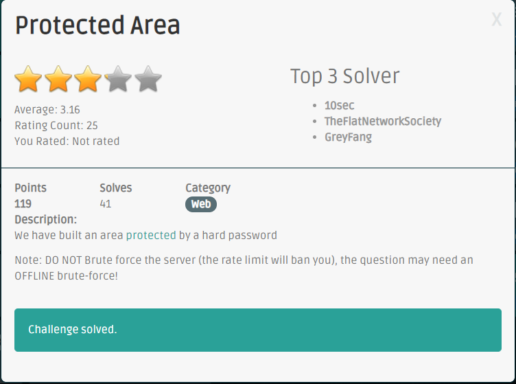

## About this CTF:
ASIS CTF is well known to be one of the harder CTFs out there, and the finals is even harder than the qualifiers. I competed with team Debugmen through this CTF, and we solved 2 non-trivial challenges and got very close with a 3rd one, Trust Zone, which I'll make a writup for if someone posts the solution for the final step of that challenge.
## Initial Analysis:
When we visit the URL, we are greeted with this webpage:
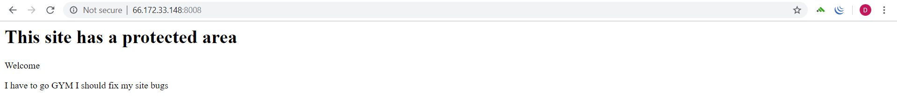

Ok, there doesn't seem to be much in here, but one thing to always look for is the HTML source of a web page. Viewing that gave us something that's more interessted

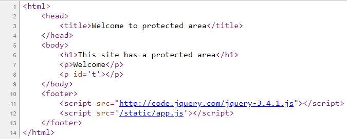

Looks like the last line on the webpage is generated dynamically by (presumably) the script in `/static/app.js`. Viewing it gave us the following:

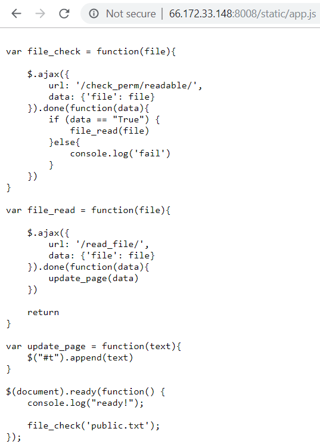

So it looks like there's two functions of interest. We could check if a file is readable by submitting a request to `/check_perms/readable/?file=XXXX`, and we could read files by submitting a request to `/read_file/?file=XXXX`. (where we replace `XXXX` with the file name that we want to check/read). Let's see what happens when we trace through this with Burp Suite.

When we check if public.txt is readable, we get the following:

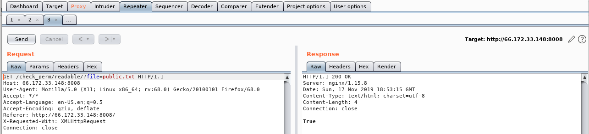

We see it returns True, which we expect. What happens when we read the file?

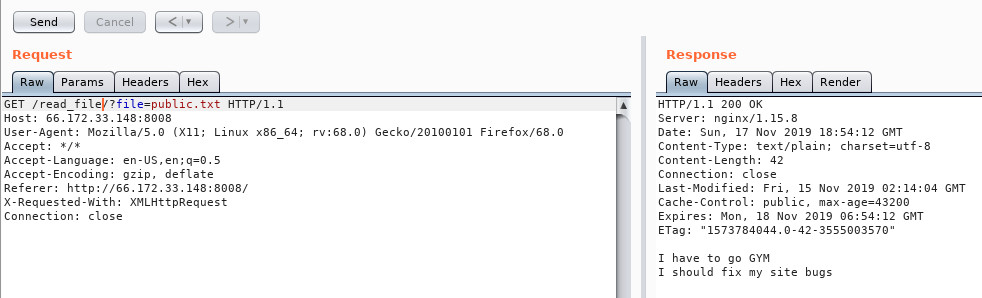

As you can see, we can see that the contents of public.txt matches the last line of the webpage, which validates our findings on how this web application works.

## Deciphering the return codes

Since `public.txt` was valid, it seemed pretty obvious to try `private.txt`:

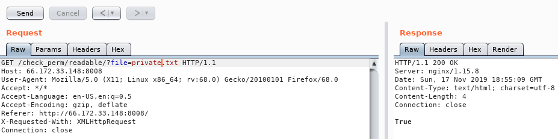

Unfortunately, the contents inside seemed pretty useless:

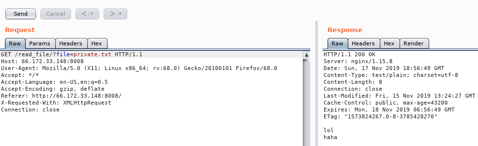

We also tried to get lucky with `flag.txt`. However trying to check the file's permissions gave us something different.

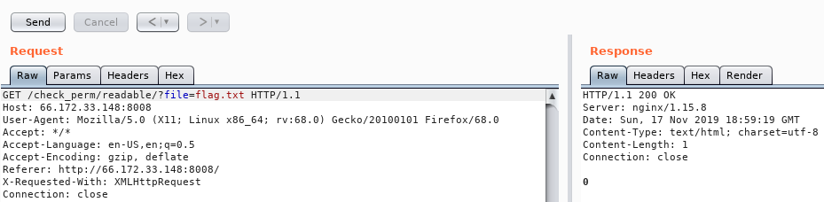

The webapp returned 0 this time instead of True! And when we read it we get the following:

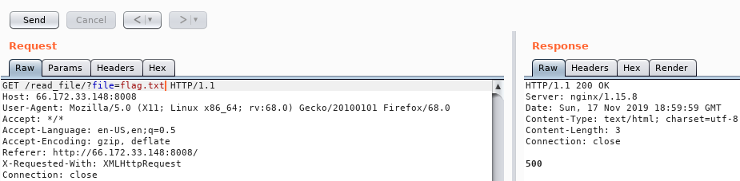

Hmm, it returned with a 500. Not sure what those mean, however we should do one more test with a file we can safely assume doesn't exist:

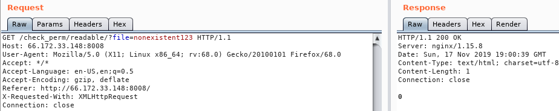

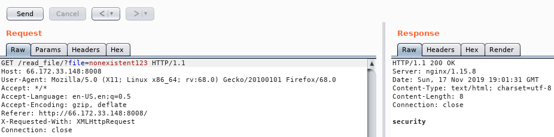

Interestingly, we still get 0 when we try to check the permissions of a nonexisting file. However, when we try to read it we get a `security` response. This clues us in that we may be dealing with a WAF (Web application firewall).

What do filenames `private.txt`, `public.txt`, and `flag.txt` have in common? All three of them end in a `.txt` extension! If we try to read the nonexistent file and add an extension of `.txt` to the end of the file, we get the `500` response back:

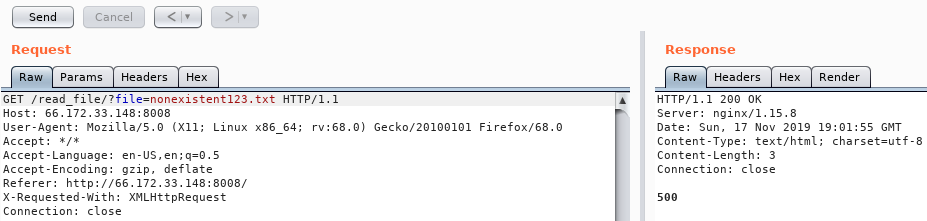

With this we can summarize/make assumptions about our findings as follows:
* If we want to read the file, our filename must end with `.txt`, or otherwise we trip the WAF. This seemingly doesn't apply for checking the file's permissions
* If a file exists, checking its permission will return true.
* If a file doesn't exist, checking its permission will return 0, and attempting to read that file will give us a 500 response.

# LFI attempts

Let's now try reading files outside of the current directory! We could specify `../` in our file name to go one directory up, in order to view files from the rest of the remote filesystem!

One interesting file to read is `/etc/passwd`. Sure enough, checking that file's existence returned `True`:

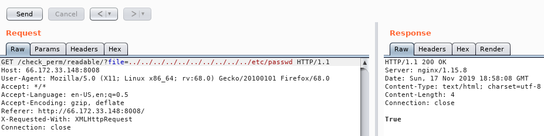

We hoped that the waf doesn't apply for files not on the filesystem, however we weren't lucky:

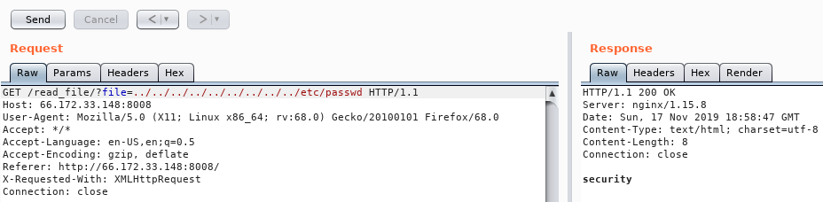

Let's first try to read a `.txt` file that we know is on the filesystem! We assumed that python3 is installed on the remote system (it comes by default with linux nowadays), so `/usr/lib/python3.5/LICENSE.txt` should be valid. Sure enough:

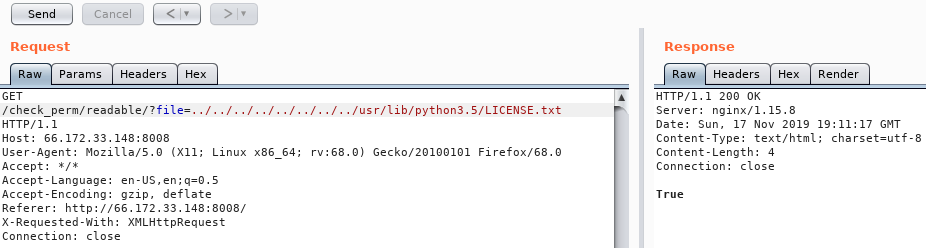

The license file exists! However, attempting to read the file gives us the following:

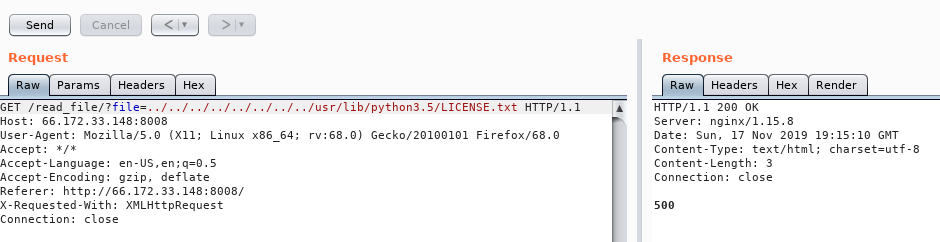

How is this possible? The check stated that that file does exist, and it ends in a `.txt` extension! What happened?

Well, notice how it returned a 500 error instead of `security`. This likely means that the WAF did catch it, but rather than stopping our request from going through, the WAF modified our request instead such that we ended up requesting an invalid file.

We could guess how the WAF modified our parameter. Since LFI attacks depend on being able to use `../` to read outside the current directory, we can guess that it looks for every occurance of `../` in our parameter, and replace it with an empty string. Therefore our parameter goes from `../../../../../../../usr/lib/python3.5/LICENSE.txt` to just `/usr/lib/python3.5/LICENSE.txt`, which shouldn't exist.

This sort of mitigation is common in WAFs. Fortunately for us, however, it's pretty easy to bypass. Instead of using `../`, we could use `....//`, so that when the WAF removes the instance of `../` in the middle, and replace it with an empty string, we still get `../` as a result. Sure enough, when we used that to read the `LICENSE.txt` file, we could read the file!

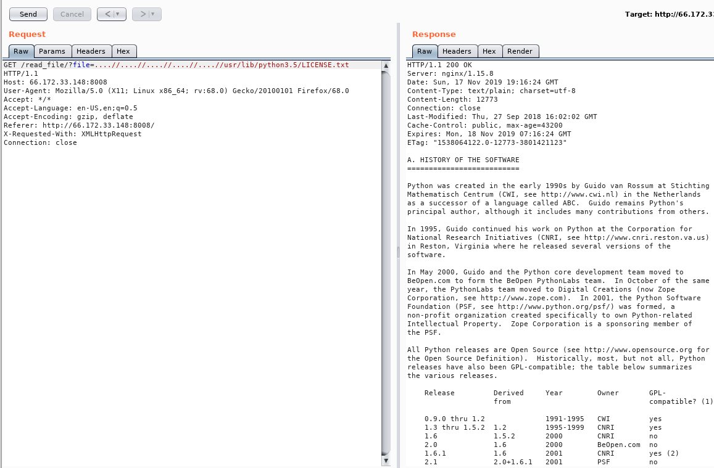

# WAF Bypass

Now that we can actually read files outside the current working directory, we still need to figure out how to bypass the waf, or else we can only read files that end with a `.txt`. Ideally, we want to read `/etc/passwd` Therefore, I needed a way to trick the WAF that our file name ends in .txt, but the file we request is the actual file.

After attempting stuff like parameter pollution and file length attacks without any result, we decided that we should try fuzzing for values right before the extension. We know that special characters in URLs could cause this sort check to behave weirdly, and so we used wfuzz to fuzz special characters before the `.txt` extension:

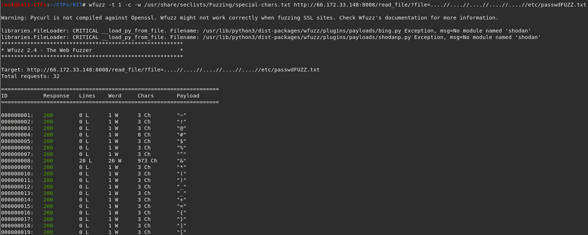

Interestingly enough, we got a result when we specify the '&' character before the extension. This was able to trick the WAF into thinking that we're reading a `.txt` file, however when the web application is parsing the file parameter, it treated `.txt` as a seperate GET parameter, separating it from the filename.

Sure enough, we are now able to read the `/etc/passwd` file:

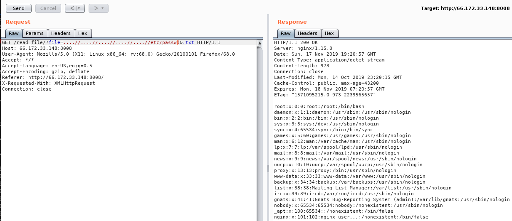

# Source code disclosure

Judging by the contents of `/etc/passwd`, this web application is running on nginx. However, none of the files in `/var/www/html/*` exist! We also get a non-standard 404 error when we visit a nonexistant page:

This indicates that even though nginx may be running, this application's running on something that's more custom. How would we find the source code of the app now?

At this time, a new challenge called 'Protected Area 2' was released, which mitigated the WAF bypass. However, the `private.txt` revealed something more interesting:

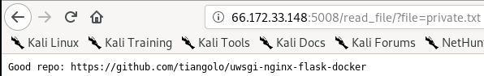

That's pretty cool! Since both challenges are very similar we can assume that's what's running on 'Protected Area'! Looking at their github repo's readme we saw the following taling about the directory structure:

Looks like the source code for the web app is in /app/main.py. Checking the permissions of that file via LFI indicates that it does exist:

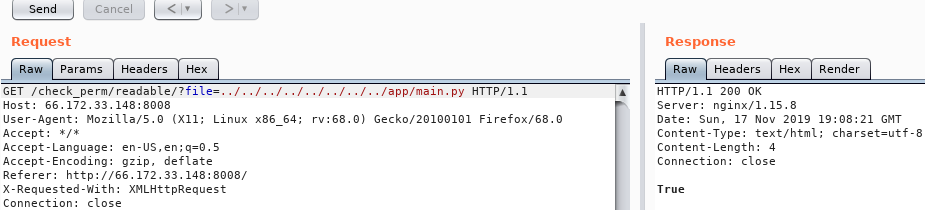

And when we read it we get the file!

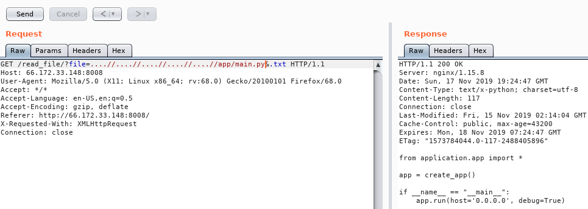

Sweet! However looking at this code we see that it just starts up the web application. It does contain an import from `application.app`, which means there's a file called `app.py` in the `/app/application` directory:

This doesn't seem like much, however there's a `from . import api` statement in the code. This indicates that there's an `api.py` in the `/app/application` directory (which is the current working directory relative to `app.py`):

Now THIS is interesting! We could see the entire logic on how the WAF forked. More importantly, however, we see a route to `/protected_area_0098`, which will give us the flag once we bypass `check_login`. Since `check_login` isn't a function we had found yet, we need to look for it.

Judging from the imports, there's a line called `from .functions import *`. This means that there's a `functions.py` file in the `/app/application` directory (which is the current working directory relative to `api.py`):

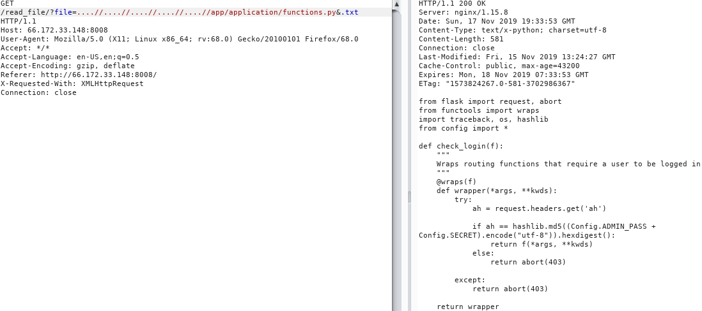

There's also a line called `from config import *`. This means that there's a `config.py` file in the `/app` directory, since the import location doesn't prefix with a '.'.

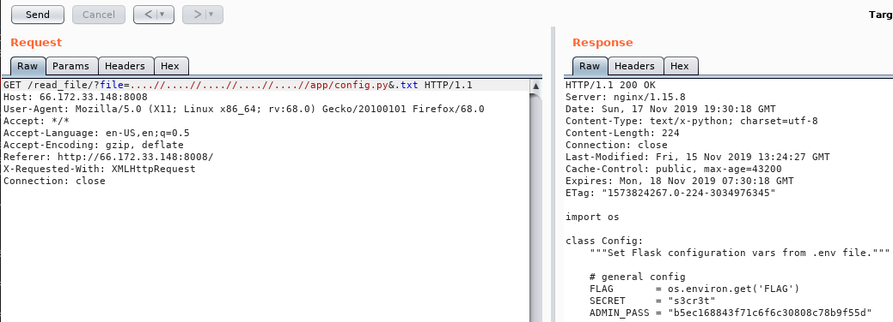

# Getting the flag

Looking back onto `functions.py` we notice something's off. The `check_login` function takes in our password through the `ah` HTTP header, and compares it with the MD5 hash of the ADMIN_PASS (which itself looks like a MD5 hash) concatenated with the SECRET (the salt). In normal login applications, this should be done in reverse: our user input should be salted and hashed, and then compared with the ADMIN_PASS. This means that we could just concatenate the ADMIN_PASS with the SECRET, and calculate it's md5 hash to get the correct authentication header:

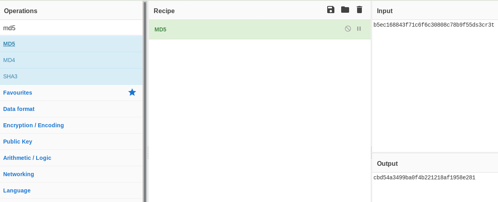

## Epilogue

Sure enough, submitting a request to `/protected_area_0098` with the correct `ah` HTTP header gives us back the flag!

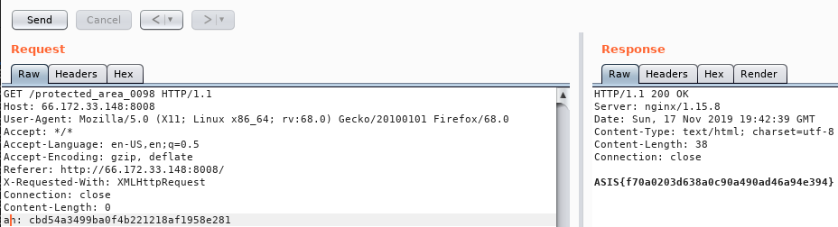

My final questions for this challenge is:
* How should we know that the source code is located at `/app/main.py` if we didn't know that the application is running form the particular docker container?

My theory is that we could get it by fuzzing for filenames, however that seems pretty unelegant given the no brute force warning.

Finally, thanks to ASIS for hosting this CTF! Looking foreward to doing some more problems next year!

