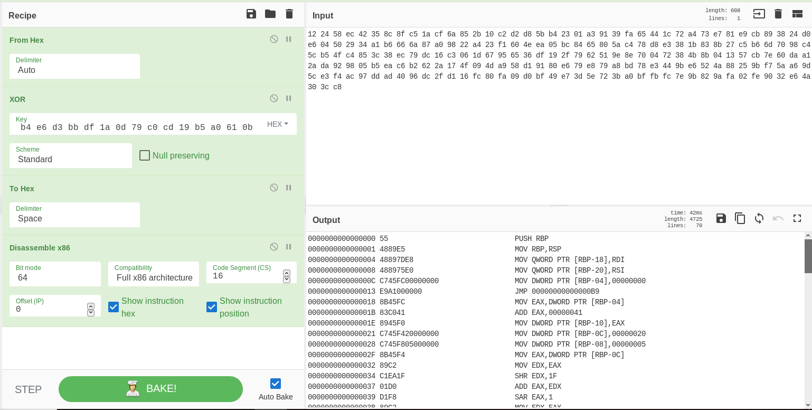
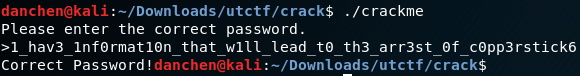

# Crackme (Reversing)
As far as crackmes go, this was moderately tough. However, as far as reversing challenges go for this CTF, this one definitely didn't deserve to have the most points (It's the only reversing challenge that I was able to solve). This challenge does combine behavior such as anti-debugging and obfuscation that is seen in malware though, which made it pretty fun to solve (even if it was last minute!), and it showcases Ghidra, a new reverse engineering tool! (Plus this was released very late into the CTF, giving me only a handful of hours to complete it.)

## Problem Statement:


## Initial Analysis:
What a memey intro. Anyways, the problem text specifies that this program might require additional dependencies, so I installed them through apt-get.

Let's see what happens when we run the file command against it.


Lol, this binary isn't even stripped. (I'd expect all reversing challenges to provide stripped binaries, especially if it's the hardest one) Other than that, everything seems normal; just a 64 bit binary.

I next ran checksec against the binary. Normally, checksec is a tool reserved for binary exploitation challenges, as it gives you clues on how to attack/exploit a binary. For reversing challenges, since we aren't probing for weaknesses inside the binary, using checksec seems unnecessary. However, the output of checksec was very interesting:


Wow, so many exploit mitigations are turned off! This is highly unusual in a reverse engineering challenge, as by default NX and canaries are turned on, and there are no regions of memory that are readable, writeable, and executable! We'll put this fact in the back of our mind.

Finally, let's run strings on the binary and see what we find:


Well there's a pretty obvious fake flag in there (and yes I did try to submit this, judge me all you like). Other than that, there seems to be password checking system in place. Finally, it looks like that this program was compiled with the Obfuscator-LLVM, which means that we're going to be dealing with some obfuscated code.
## Attempting dynamic analysis

Let's try running the program:


Well, besides the fake flag, this (as all crackmes are) was very simple. Let's try attaching gdb to this binary, set a breakpoint to main, and run it!


Wait what? Why did that fail? I guessed that somewhere before main was called, the program calls ptrace() to detect if another process is tracing this program, and if so, exit. (a common anti-debugging technique). I tried tracing back to _start() and __libc_start_main() to see where the ptrace() call was called, but never found it... Fine then, if you want me to solve you statically, I'll do it!

## Static analysis with Ghidra:

Let's try opening up this program with Ghidra, and see what's going on with the main method:


Wow, this decompilation is so clear! From the decompilation, we see that the program is reading input through stdin via fgets(), performs a bunch of operations on it, does a memcmp() with a region of memory called test, and if it's equal, print out that the password was correct.

Let's break down the checks one by one. The fgets call limits the input to 0x40 bytes, and checks to see if the length is less than 0x40 bytes. If so, continue with the check.


The progam next calls divide() with 0x20 as the first parameter, and 0 as the second parameter. Let's look at what divide does:


Hmm, so it just divides the 1st parameter by the 2nd parameter, and returns the result. However, if the 2nd parameter is 0, an exception is raised and passed through the exception handler. (divide by 0)

Since we know that 0 is the 2nd parameter, we know that the exception would be raised every time. However, what happens then?

Well, if we recall from the decompiled main method, we did see a region that indicated that there's a try catch block:


The call to divide() occured at address 0x400bd1, which is within the try block (0x400bc9 to 0x400bd5). Since the call will definitely raise an exception, the catch block (at 0x400c3c) will always be called. Let's see what happens within the catch block:


Woah, what happened? The function looks completely different! (but not completely different as I can still see the "Correct Password" print). In addition all the variables are messed up now, so I lost track of which variables are which.

Turns out, Ghidra struggles with parsing out try-catch blocks. Let's use our good old IDA for this portion of the disassembly (after all the variables are named):


This snippet on the right is fairly simple. It basically does array indexing on the input string, and xors it with constant values. Specifically, it xors *(&input_string + 52) with 0x43, and then xors *(&input_string + 45 + 2) with (0x43 + 1), and stores them in the respective locations. In the code, this is all it does:

```
input_string[52] = input_string[52] ^ 0x43;
input_string[47] = input_string[47] ^ 0x44;
```

Xor operations are reversible through this mathematical property:
```
(A ^ B) ^ B = A
```

So if we xor input_stirng[52] with 0x43 and input_string[47] with 0x44, we should get our initial values back.

Finally, we exit the catch block. Since both the left and the right blocks point to the same location, 0x400C9D, we can assume that the execution of main() will continue, and so we can move back to Ghidra.

## Continue analysis of main()

When we highlight 0x400c9d, the corresponding area of the decompiler lights up as well:


This while loop looks obvious. local_58 is the input string, and local_88 is the index that gets incremented through each iteration. It's pretty clear that this xors each character of the input with 0x27, which is reversible from the mathematical property above.

However, the next few statements are much more interesting:


We have a new index, local_98. However, we are doing some operations with two arrays (stuff1 and stuff2) of presumably length 0xcb, which is then called with the input string as the first parameter, and the length of the input string (sVar2) as the second parameter.

Let's use IDA's hexdump to view these values:


The red chunk is stuff1[] and the blue section is stuff2[], and the green section is test[]. Let's figure out what it's doing!

## Shellcode execution

Since stuff1 and stuff2 are both 0xcb bytes in size, the operations performed involve every single byte of them. For each byte of stuff1, stuff1[index] is set to the result of xoring the value of stuff1[index] - 1 with stuff2[0xca - index]. To reverse this, I'll need to reverse the order of stuff2, decrement each value of stuff1 by 1, and xor both together to see what happens.

First, I used cyberchef to reverse the values of stuff2:


Unfortunately, cyberchef doesn't have an option to decrement all ascii values down by 1, so I wrote this C snippet to do it for me:

```C
#include <stdio.h>
#include <stdlib.h>

int main() {
    FILE *fr = fopen("stuff1.txt", "rb");
    char buf[204];
    //fgets(buf, 204, (FILE*)fr);
    for(int a = 0; a < 203; a++) {
        buf[a] = fgetc(fr);
    }
    for(int i = 0; i < 203; i++) {
        buf[i] = (char)((int)buf[i] - 1);
    }
    fclose(fr);
    FILE *fw = fopen("output.txt", "wb");
    fputs(buf, fw);
    fclose(fw);
}
```

...and here's the result:


Now, let's use Cyberchef to see what happens when we xor them together:


Hmm, this looks meaningless! But everything worked the way the decompilation indicated it did! What happened?

Well, if we remember from earlier, checksec indicated that regions of memory were readable, writeable, and executable. This included the .bss section, where stuff1 and stuff2 are stored. What if we attempt to disassemble this code?



The Push RBP; Mov RBP, RSP; header looks so familiar! It's typically the first actions that are done when a function is called: Save the base pointer on the stack, set the new base pointer as the current stack pointer! Below is the complete disassembled shellcode:

```
0000000000000000 55                              PUSH RBP
0000000000000001 4889E5                          MOV RBP,RSP
0000000000000004 48897DE8                        MOV QWORD PTR [RBP-18],RDI
0000000000000008 488975E0                        MOV QWORD PTR [RBP-20],RSI
000000000000000C C745FC00000000                  MOV DWORD PTR [RBP-04],00000000
0000000000000013 E9A1000000                      JMP 00000000000000B9
0000000000000018 8B45FC                          MOV EAX,DWORD PTR [RBP-04]
000000000000001B 83C041                          ADD EAX,00000041
000000000000001E 8945F0                          MOV DWORD PTR [RBP-10],EAX
0000000000000021 C745F420000000                  MOV DWORD PTR [RBP-0C],00000020
0000000000000028 C745F805000000                  MOV DWORD PTR [RBP-08],00000005
000000000000002F 8B45F4                          MOV EAX,DWORD PTR [RBP-0C]
0000000000000032 89C2                            MOV EDX,EAX
0000000000000034 C1EA1F                          SHR EDX,1F
0000000000000037 01D0                            ADD EAX,EDX
0000000000000039 D1F8                            SAR EAX,1
000000000000003B 89C2                            MOV EDX,EAX
000000000000003D 8B45F8                          MOV EAX,DWORD PTR [RBP-08]
0000000000000040 8D0C02                          LEA ECX,[RDX+RAX]
0000000000000043 BA93244992                      MOV EDX,92492493
0000000000000048 89C8                            MOV EAX,ECX
000000000000004A F7EA                            IMUL EDX
000000000000004C 8D040A                          LEA EAX,[RDX+RCX]
000000000000004F C1F802                          SAR EAX,02
0000000000000052 89C2                            MOV EDX,EAX
0000000000000054 89C8                            MOV EAX,ECX
0000000000000056 C1F81F                          SAR EAX,1F
0000000000000059 29C2                            SUB EDX,EAX
000000000000005B 89D0                            MOV EAX,EDX
000000000000005D 89C2                            MOV EDX,EAX
000000000000005F C1E203                          SHL EDX,03
0000000000000062 29C2                            SUB EDX,EAX
0000000000000064 89C8                            MOV EAX,ECX
0000000000000066 29D0                            SUB EAX,EDX
0000000000000068 83F802                          CMP EAX,00000002
000000000000006B 750E                            JNE 000000000000007B
000000000000006D 8B45F0                          MOV EAX,DWORD PTR [RBP-10]
0000000000000070 8B45F0                          MOV EAX,DWORD PTR [RBP-10]
0000000000000073 83E804                          SUB EAX,00000004
0000000000000076 8945F0                          MOV DWORD PTR [RBP-10],EAX
0000000000000079 EB12                            JMP 000000000000008D
000000000000007B 8B45F0                          MOV EAX,DWORD PTR [RBP-10]
000000000000007E 83E841                          SUB EAX,00000041
0000000000000081 8945F0                          MOV DWORD PTR [RBP-10],EAX
0000000000000084 8B45F0                          MOV EAX,DWORD PTR [RBP-10]
0000000000000087 83C033                          ADD EAX,00000033
000000000000008A 8945F0                          MOV DWORD PTR [RBP-10],EAX
000000000000008D 8B45F0                          MOV EAX,DWORD PTR [RBP-10]
0000000000000090 8B55FC                          MOV EDX,DWORD PTR [RBP-04]
0000000000000093 4863CA                          MOVSXD RCX,EDX
0000000000000096 488B55E8                        MOV RDX,QWORD PTR [RBP-18]
000000000000009A 4801CA                          ADD RDX,RCX
000000000000009D 0FB60A                          MOVZX ECX,BYTE PTR [RDX]
00000000000000A0 89C6                            MOV ESI,EAX
00000000000000A2 8B45FC                          MOV EAX,DWORD PTR [RBP-04]
00000000000000A5 4863D0                          MOVSXD RDX,EAX
00000000000000A8 488B45E8                        MOV RAX,QWORD PTR [RBP-18]
00000000000000AC 4801D0                          ADD RAX,RDX
00000000000000AF 31F1                            XOR ECX,ESI
00000000000000B1 89CA                            MOV EDX,ECX
00000000000000B3 8810                            MOV BYTE PTR [RAX],DL
00000000000000B5 8345FC01                        ADD DWORD PTR [RBP-04],00000001
00000000000000B9 8B45FC                          MOV EAX,DWORD PTR [RBP-04]
00000000000000BC 4898                            CDQE
00000000000000BE 483945E0                        CMP QWORD PTR [RBP-20],RAX
00000000000000C2 0F8750FFFFFF                    JA 0000000100000018
00000000000000C8 90                              NOP
00000000000000C9 5D                              POP RBP
00000000000000CA C3                              RET

```
This is quite a hefty chunk of assembly to analyze. Fortunately, Ghidra can even decompile r a w  s h e l l c o d e ! 😱


Hmm, seems like the local variables are different again. However, this is simple enough for me to figure out what it's doing with the input_string (the first parameter), and the input_string_length. (the second parameter). Here's what a fully decompiled version of this function could look like:

```C
void shellcode(char *input_string, int input_length) {
    int index = 0;
    while(index < input_length) {
        input_string[index] = input_string[index] ^ (0x33 + index);
        index++;
    }
}
```

Since these are all xor operations, everything here is reversible as well. This was quite some obfuscation!

## Obtaining the flag.
Finally, the program compares 0x40 bytes of the (heavily modified) input string to the memory stored in test. If the values match, we get the password; otherwise, we have the wrong password:


The test area was the green region from the IDA memory screenshot above. Now that we know how the password was obfuscated, as well as what the results should be, we can therefore perform these actions to obtain our password:

* Reverse the xor's performed by the shellcode on the input string
* Reverse the xor's performed by the first while loop
* Reverse the xor's performed by the catch block.

We can do the first two through Cyberchef:


Almost! However, we must remember to do the xor operation on input_string[47] and input_string[52] to get our final password:

```1_hav3_1nf0rmat10n_that_w1ll_lead_t0_th3_arr3st_0f_c0pp3rstick6```

...and sure enough:



## Epilogue
Thanks to the UTCTF team for this challenge! This was tough but Ghidra made this into a pretty manageable challenge.

One remaining thing was: Why was the debugger failing? After the competition, I discovered that *before* main() is called, the llvm obfuscator calls _csu_init() first, which looked like this:


Sure enough, there's that pesky anti-debugging code I was looking for! _csu_init() calls ptrace to determine if the program was being traced by another process (e.g. a debugger), and exits with error code 1 if that was the case! Since this was called before main(), this explains why my breakpoint in main kept failing! 

One way to fix that was to patch the binary. Unfortunately, Ghidra has some known issues with binary patching, but the way to do it is to replace the instructions that call ptrace() with 0x90s, or No-ops. Oh well, at least the static analysis wasn't overly difficult!

Finally, I am aware that it might be possible to use angr to solve this completely. However, what's the fun in just running a tool to do everything for you? :) (although Ghidra could be seen as such a tool.)
