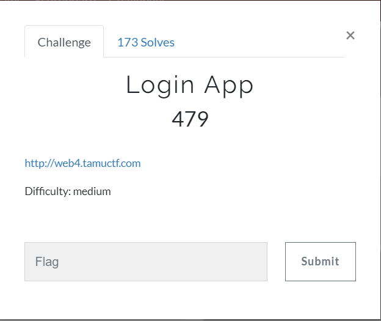
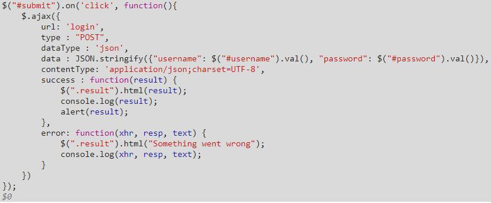
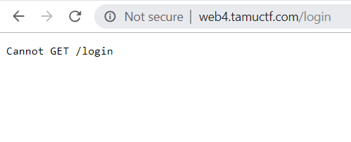
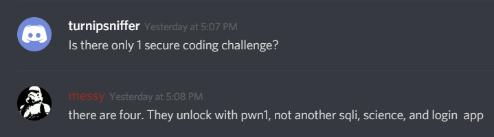
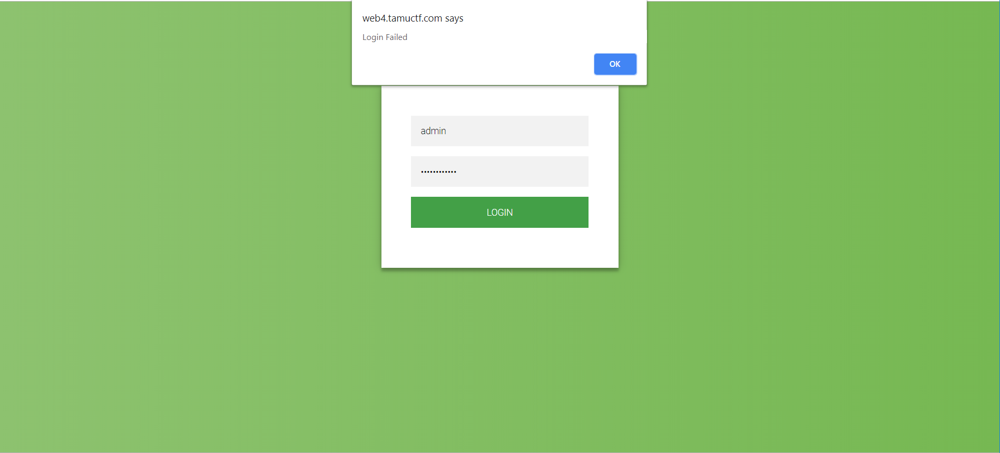
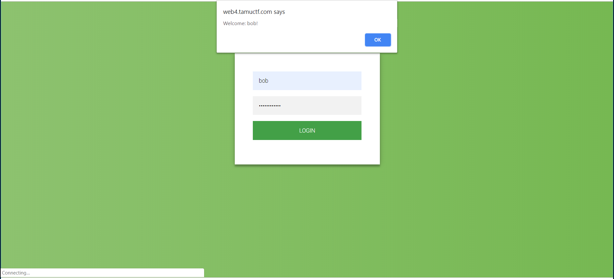
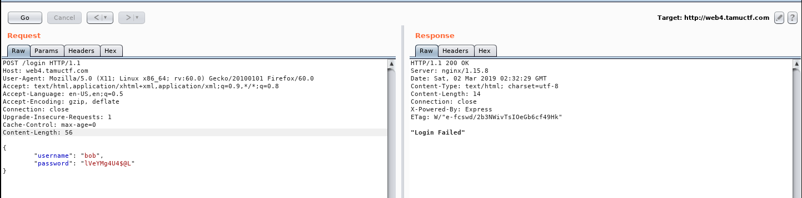
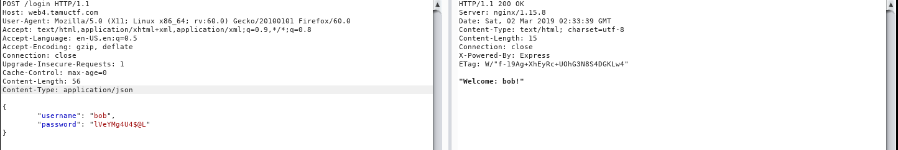
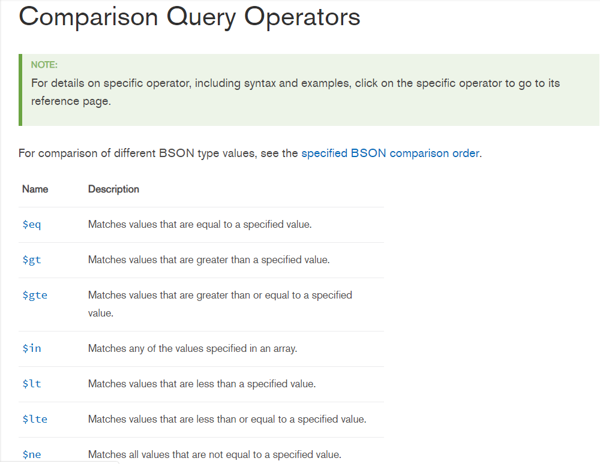
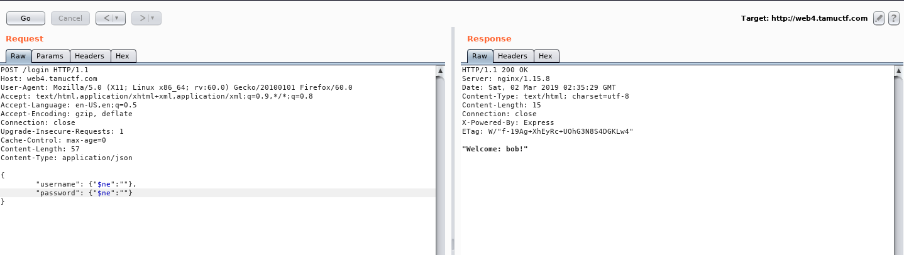

# Login App (web)
This was a fun challenge, as I ('m pretty sure that I ) found an unintential approach to it that made it much, much easier than it should have been. I also suck at web app exploitation (more of a reversing/binex person), so solving this challenge felt really good (even though I highly doubt I would be able to do it without the unintented way)

## Problem Statement:



## About this CTF:
The Texas A&M CTF team went all out on the infrastructure for this CTF, as there were challenges that featured entire internal networks that we can perform penetration tests on! One of the most exciting aspects of this CTF is that there's a dedicated category called Secure Coding, unlocked when you solve the respective web/pwn challenges, that gives you an opportunity to fix their vulnerable code for extra CTF points! While I think this was a great idea that should definitely be featured in future CTFs, there was one tiny flaw that I eventually (ab)used for this challenge.......
## Initial Analysis:
When we visit the URL, we are greeted with this webpage:


There doesn't seem to be much on the face of the login application, so I tried the standard means of authentication (Using weak credentials, trying SQL injection, etc.). None of these worked; however I see that the "login failed" text is shown to us as an alert, which indicates that some javascript might be involved:



Cool, so it's using Ajax to send our username and password in a Json format as a POST request to what I presume is the /login page. However, when I tried to actually visit the /login page in my browser, I was greeted with this:



Looks like I'm forced to use a POST request in order to interact with this webpage...

## Secure Coding leak

At this moment, I was also looking to see what was vulnerable about this webapp. I then remembered that one of the CTF admins posted this in the CTF discord:



Turns out Login App was one of the challenges that will unlock a respective Secure Coding challenge! We've solved the other three challenges, and we know that the URL for their respective secure coding challenges are:

* SQL: https://gitlab.tamuctf.com/root/sql
* PWN: https://gitlab.tamuctf.com/root/pwn
* Science: https://gitlab.tamuctf.com/root/science

Maybe it's possible to guess the URL for the secure coding challenge for Login App! After trying a few URLs, I discovered that https://gitlab.tamuctf.com/root/loginapp ended up being the correct URL:


WOW, we get to learn so much more about the challenge! The front page indicates that the vulnerability in question is a NoSQL injection vulnerability, and we get access to several *.js files that looks exactly like what's running on the backend of the Login App challenge! The contents in db.js told us that the backend is running MongoDB, which is useful in telling us what type of injection to try. The server.js file is as follows:

```javascript
// server.js

const initDb = require("./db").initDb;
const getDb = require("./db").getDb;
const express = require('express');
const app = express();
var bodyParser = require('body-parser')
app.use(bodyParser.json())

var path = require("path");

const PORT = 4000;

initDb(function (err) {
    app.get('/', function(req, res) {
        res.sendFile(path.join(__dirname+'/index.html'));
    });  

    app.post('/login', function (req, res) {

        const db = getDb();
        c = db.db('test');
    
        var query = {
            username: req.body.username,
            password: req.body.password
        }

        c.collection('users').findOne(query, function (err, user) {
            if(user == null) {
                res.send(JSON.stringify("Login Failed"))
            }
            else {
                resp = "Welcome: " + user['username'] + "!";
                res.send(JSON.stringify(resp));
            }
        });
    });
 
    app.listen(PORT, function (err) {
        const db = getDb();

        user = {username: 'bob', password: 'lVeYMg4U4$@L'}
        admin = {username: 'admin', password: '945IYMib!u@u'}

        c = db.db('test');
        c.collection('users').insertOne(user)
        c.collection('users').insertOne(admin)

        if (err) {
            throw err; //
        }
        console.log("Up and running on port " + PORT);
    });
});
```
I had no idea what the majority of this javascript does, however I didn't need that information. I first saw that two users, bob and admin, seems to have their username and password hardcoded! Let's first try out the admin's password:

Hmm, looks like the admin password in the database has changed. Let's try Bob's password:


Bob's credentials actually worked! However, we aren't redirected to a different page, so it seems as if logging in as Bob did nothing. However, since this login was successful, we do have a working set of credentials that we can mess around with.
## MongoDB Injection

Because I'm lazy, (and because I expected myself to need multiple requests in order to log in as admin), I decided to fire up Burp Suite, and point it at web4.tamuctf.com/login to send my POST requests. I begin with bob's username and password, as seen here:



What?! I thought this was the correct username and password! This caused me a few hours of struggle (due to my inexperience), but I eventually figured out that I needed to set the Content-Type: option in my POST request to be application/json, so that the server will expect and parse my JSON parameter. Sure enough, I was finally able to log into bob in burp:



Cool, now I can begin injecting my MongoDB queries! I had no prior knowledge of NoSQL injection, so time to do some research on them. After reading a bit, I came into this tidbit in the MongoDB documentation:



I also found out that you can use a JSON object instead of a string as a value. Putting it altogether, I developed this payload to send to the login app:
```json
{   
     "username": {"$ne":""},
     "password": {"$ne":""}
}
```
In theory, this should effectively dump the database of usernames, as any non-empty username users with a non-empty password should match this query. However, when I sent it through burp, I got the following:



This is weird. Is Bob the only user in the database?! This took me again some hours to figure out, but I eventually realized that MongoDB only returns the first user that matches a given query, and since the user bob was first added to the database, his entry would be the first one that matches the query. Therefore, I will need to specify the username as "admin" in order to log in as the admin user.

## Epilogue
Sure enough, once we log in as the admin user, we obtain the flag:


I was kinda disappointed that we didn't need the admin password at the end. However, if we needed to obtain the admin password, we could just brute force it character by character using the $gte and the $lte operators.

My final questions for this challenge is:
* How were we supposed to figure out that MongoDB is processing our username/password queries without getting the secure coding page?
* How were we supposed to figure out that "admin" was a valid user?

My theory is that we should guess it for both of them, but is there any better way to obtain these pieces of information?

Finally, thanks to Texas A&M for hosting this CTF! Looking foreward to doing some more problems next year!

